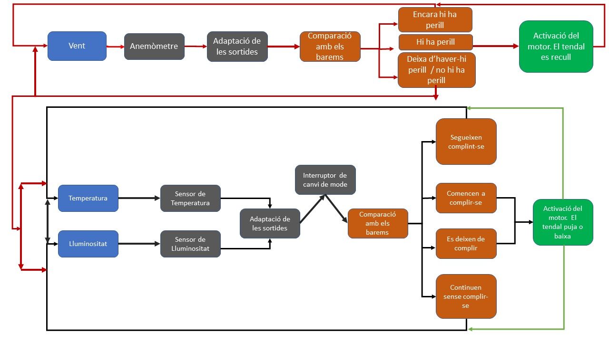

# Automated-Awning

The main goal of this project was to study, design and build a motorised awning that is able to respond
to some meteorological stimuli automatically, thus anticipating temperature rises in the appartment and preventing the deterioration of furniture and
paintings caused by sunlight. The automation of the awning also guarantees
optimal safety thresholds through the incorporation of a wind sensor, that provides to the system an extra degree of freedom which is used to decide whether it is necessary to pick up the awning when wind conditions are adverse.

The next figure shows a schematic Flowchart that summarizes the awning behaviour.

  

## Notes

This code was designed to work together with a circuital equipment. All the explanations on the electronics, calibration and performance can be found on the pdf inside the 'Project' folder (In Catalan).
